# HR&GA E-Memo Online System — Entity Relationship Diagram

**Complete Auto Rubber Manufacturing Co., Ltd.**
MySQL 8 / InnoDB / `utf8mb4_unicode_ci` · **17 ตารางจริง** · 4 โดเมน
สร้างเมื่อ 2026-07-27 · แหล่งอ้างอิง: `sandbox/db/init/001-db1-schema.sql` + `sandbox/db/migrations/*.sql`

## ไฟล์ในชุดนี้

| ไฟล์ | ใช้ทำอะไร |
|---|---|
| `hr-ememo-erd.html` | **Interactive ER Diagram** — เปิดในเบราว์เซอร์ได้เลย มีตัวกรองโดเมน / ค้นหาตาราง / แผงรายละเอียดคอลัมน์ / zoom-pan / export SVG |
| `hr-ememo-erd.mmd` | Mermaid `erDiagram` source (diagram-as-code, commit ลง git ได้, render ใน GitHub/GitLab/VS Code) |
| `hr-ememo-erd.drawio` | ไฟล์ draw.io แก้ไขได้ — แบ่งเป็น 4 กรอบโดเมน, ใช้ ER crow's-foot notation |
| `drawio-open-url.txt` | URL เปิดไฟล์ draw.io ในเบราว์เซอร์ทันที (ข้อมูลอยู่หลัง `#` ไม่ถูกอัปโหลด) |
| `preview/page1–5.png` | ภาพ preview แต่ละหน้า (เรนเดอร์จากพิกัดในไฟล์ `.drawio` ไม่ใช่ export จาก draw.io — ใช้ดูโครงคร่าว ๆ) |

### โครงสร้าง 5 หน้าใน `hr-ememo-erd.drawio`

ERD หน้าเดียวอ่านยากเพราะ `users` มี degree 12 และ `memos` มี 9 → **21 จาก 22 เส้นวิ่งเข้าหา hub** ทำให้เส้นตัดกัน 76 จุด เลยแยกเป็น 5 หน้า

| หน้า | เนื้อหา | เส้นตัดกัน |
|---|---|---|
| 1 | **Overview Map** — 17 กล่องแบบย่อ (ชื่อ + คำอธิบายไทย) เห็นความสัมพันธ์ทั้งหมดในตาเดียว | 30 |
| 2 | [1] User & Auth — คอลัมน์ครบ | 0 |
| 3 | [2] Core E-Memo & Workflow — `memos` แสดงครบทั้ง 39 คอลัมน์ | 0 |
| 4 | [3] Notification & Telegram | 0 |
| 5 | [4] Dispatch & Issue | 0 |

หน้า 2–5 ใช้ **off-page connector** — ตารางที่อยู่คนละหน้าจะแทนด้วยกล่องเทาเส้นประเล็ก ๆ เช่น `users ↗ p.2` วางชิดแถว FK ที่อ้างถึง แทนการลากเส้นยาวข้ามหน้า จึงไม่มีเส้นตัดกันเลย

### หมายเหตุเรื่องการเดินเส้น

ทุกเส้นกำหนด **routing lane** ตายตัวด้วย waypoint แทนที่จะปล่อยให้ draw.io auto-route เพราะ auto-routing เคยลากเส้นทะลุกลางกล่อง `memos` ทับตัวอักษร มีสคริปต์ตรวจว่าไม่มี segment ใดตัดผ่านกล่อง entity และไม่มีกล่องซ้อนกัน — **ถ้าย้ายตำแหน่งตารางใน draw.io ต้องย้าย waypoint ตามด้วย**

---

## ⚠️ สิ่งที่ต่างจาก schema ที่ระบุมาในโจทย์

ผมสร้าง ERD จาก migration จริงในโปรเจ็กต์ ไม่ใช่จากรายการที่ให้มา เพราะมีจุดที่ไม่ตรงกัน:

| ในโจทย์ | ของจริงใน DB | หมายเหตุ |
|---|---|---|
| `telegram_accounts` | **`user_telegram_accounts`** | ชื่อตารางต่างกัน |
| `telegram_callback_action_tokens` | **`telegram_action_tokens`** | ชื่อตารางต่างกัน + มี `user_id` FK ด้วย |
| `dispatch_items (item_name, quantity)` | **`dispatch_recipients`** | ไม่ใช่ตารางรายการสินค้า แต่เป็น **ผู้รับหนังสือเวียน** + สถานะ read/acknowledged |
| `audit_logs` | **ไม่มีอยู่จริง** | หน้า `/audit` derive จาก `workflow_step_actions` ผ่าน `lib/audit-query.ts` |
| `issue_reports.user_id` | `reporter_user_id` + `resolved_by_user_id` | มี FK สองเส้นชี้กลับ `users` |
| — | **`notifications` + `notification_deliveries`** | ขาดไปในโจทย์ แต่เป็นแกนของ notification channel |
| — | **`telegram_link_tokens`, `telegram_conversation_states`** | ขาดไปในโจทย์ |

---

## Mermaid Code (ย่อ — เฉพาะโครงความสัมพันธ์)

ฉบับเต็มพร้อมทุกคอลัมน์อยู่ใน [`hr-ememo-erd.mmd`](./hr-ememo-erd.mmd)

```mermaid
erDiagram
    %% ---------- [1] USER & AUTH ----------
    users {
        bigint  id              PK
        varchar employee_card_id UK
        varchar email           UK
        varchar roles_json      "admin|requester|manager|read-recipient"
        varchar approval_level  "Manager|GM|MD"
        enum    status          "pending|active|suspended"
    }
    memo_templates        { bigint id PK  bigint user_id FK  json template_json }
    password_reset_tokens { bigint id PK  bigint user_id FK  char token_hash UK }

    %% ---------- [2] CORE E-MEMO & WORKFLOW ----------
    memos {
        bigint  id                 PK
        varchar memo_no            UK
        bigint  requester_user_id  FK
        bigint  item_subcategory_id FK
        decimal amount             "DECIMAL(15,2)"
        varchar status             "draft|pending|approved|rejected|returned"
        json    selected_route_json "เส้นทางอนุมัติที่ใช้จริง"
        boolean requires_md_review  "MD Review gate"
        int     revision_no
        datetime deleted_at        "soft-delete"
    }
    item_subcategories    { bigint id PK  varchar category_key UK  varchar label_th UK }
    memo_revisions        { bigint id PK  bigint memo_id FK  int revision_no UK  json snapshot_json }
    workflow_step_actions { bigint id PK  bigint memo_id FK  varchar action_type  varchar step_label }
    read_actions          { bigint id PK  bigint memo_id FK  varchar recipient_name UK  varchar status }

    %% ---------- [3] NOTIFICATION & TELEGRAM ----------
    notifications           { bigint id PK  bigint memo_id FK  bigint recipient_user_id FK  boolean is_read }
    notification_deliveries { bigint id PK  bigint notification_id FK  varchar channel UK }
    user_telegram_accounts  { bigint id PK  bigint user_id FK  bigint telegram_user_id UK }
    telegram_link_tokens    { bigint id PK  bigint user_id FK  char token_hash UK }
    telegram_action_tokens  { bigint id PK  bigint memo_id FK  bigint user_id FK  char token_hash UK }
    telegram_conversation_states { bigint id PK  bigint user_id  bigint memo_id  varchar state }

    %% ---------- [4] DISPATCH & ISSUE ----------
    dispatches          { bigint id PK  varchar dispatch_no UK  bigint sender_user_id FK  bigint memo_id FK }
    dispatch_recipients { bigint id PK  bigint dispatch_id FK  bigint target_user_id FK  enum status }
    issue_reports       { bigint id PK  bigint reporter_user_id FK  bigint resolved_by_user_id FK  enum status }

    %% ---------- RELATIONSHIPS ----------
    users ||--o{ memo_templates        : "บันทึกเทมเพลตส่วนตัว"
    users ||--o{ password_reset_tokens : "ขอรีเซ็ตรหัสผ่าน"
    users ||--o{ memos                 : "เป็นผู้ยื่นคำขอ"

    item_subcategories ||..o{ memos    : "จัดหมวดหมู่รายการ (logical)"
    memos ||--o{ memo_revisions        : "ประวัติการแก้ไข"
    memos ||--o{ workflow_step_actions : "บันทึกทุก action (audit)"
    memos ||--o{ read_actions          : "ผู้รับทราบ"

    memos ||--o{ notifications                   : "สร้างการแจ้งเตือน"
    users ||--o{ notifications                   : "เป็นผู้รับการแจ้งเตือน"
    notifications ||--o{ notification_deliveries : "แตกเป็นช่องทางส่ง"

    users ||--o{ user_telegram_accounts       : "ผูกบัญชี Telegram"
    users ||--o{ telegram_link_tokens         : "ออก token ผูกบัญชี"
    users ||--o{ telegram_action_tokens       : "ผู้มีสิทธิ์กดปุ่ม"
    memos ||--o{ telegram_action_tokens       : "เป้าหมายของ callback"
    users ||..o{ telegram_conversation_states : "logical (ไม่มี FK)"
    memos ||..o{ telegram_conversation_states : "logical (ไม่มี FK)"

    users ||--o{ dispatches               : "เป็นผู้ส่งหนังสือเวียน"
    memos |o--o{ dispatches               : "อ้างอิงบันทึกต้นเรื่อง"
    dispatches ||--o{ dispatch_recipients : "กระจายถึงผู้รับ"
    users ||--o{ dispatch_recipients      : "เป็นผู้รับหนังสือเวียน"
    users |o--o{ issue_reports            : "แจ้งปัญหา / ปิดเรื่อง"
```

---

## สรุปความสัมพันธ์ (Cardinality)

| # | Parent | Child | Cardinality | ON DELETE | ความหมายเชิงธุรกิจ |
|---|---|---|---|---|---|
| 1 | `users` | `memo_templates` | 1 : 0..N | CASCADE | ผู้ใช้เก็บเทมเพลตฟอร์มของตัวเอง ลบ user = ลบเทมเพลตทิ้ง |
| 2 | `users` | `password_reset_tokens` | 1 : 0..N | CASCADE | โทเคนรีเซ็ตรหัสผ่าน มีอายุ + ใช้ครั้งเดียว |
| 3 | `users` | `memos` | 1 : 0..N | SET NULL | ผู้ยื่นคำขอ (`requester_user_id` เป็น NULL ได้สำหรับ memo เก่า/seed) |
| 4 | `item_subcategories` | `memos` | 1 : 0..N | *(logical)* | หมวดย่อยตาม Book1.xlsx — เก็บทั้ง id และ label กันข้อมูลเพี้ยนเมื่อ master เปลี่ยน |
| 5 | `memos` | `memo_revisions` | 1 : 0..N | RESTRICT | 1 memo มีหลายรอบแก้ไข, `UNIQUE(memo_id, revision_no)` |
| 6 | `memos` | `workflow_step_actions` | 1 : 0..N | RESTRICT | **Append-only ledger** ทุก approve/return/reject/void → เป็นแหล่งของ Audit Trail |
| 7 | `memos` | `read_actions` | 1 : 0..N | RESTRICT | ผู้รับทราบ (acknowledge) แยกจากผู้อนุมัติเด็ดขาด |
| 8 | `memos` | `notifications` | 1 : 0..N | RESTRICT | `memo_id` NULL ได้ (แจ้งเตือนระดับระบบ) |
| 9 | `users` | `notifications` | 1 : 0..N | RESTRICT | `recipient_user_id` — กรองใน SQL เสมอ ป้องกันเห็นข้ามคน |
| 10 | `notifications` | `notification_deliveries` | 1 : 0..N | RESTRICT | 1 แจ้งเตือน → หลายช่องทาง, `UNIQUE(notification_id, channel)` กันส่งซ้ำ |
| 11 | `users` | `user_telegram_accounts` | 1 : 0..N *(active 1:1)* | RESTRICT | `is_active` + `revoked_at` ทำให้เก็บประวัติการผูก/ยกเลิกได้ |
| 12 | `users` | `telegram_link_tokens` | 1 : 0..N | RESTRICT | โทเคน deep-link `/start` |
| 13 | `users` + `memos` | `telegram_action_tokens` | 1 : 0..N (สองทาง) | RESTRICT | ปุ่มอนุมัติใน Telegram — one-time token ผูกทั้งคนและ memo |
| 14 | `users` / `memos` | `telegram_conversation_states` | 1 : 0..N | *(ไม่มี FK)* | สถานะสนทนาชั่วคราว (รอพิมพ์เหตุผล) มี `expires_at` — จงใจไม่ผูก FK |
| 15 | `users` | `dispatches` | 1 : 0..N | RESTRICT | ผู้ส่งหนังสือเวียน |
| 16 | `memos` | `dispatches` | 0..1 : 0..N | SET NULL | หนังสือเวียนอ้างบันทึกต้นเรื่องได้ (ไม่บังคับ) |
| 17 | `dispatches` | `dispatch_recipients` | 1 : 0..N | CASCADE | ลบหนังสือเวียน = ลบรายชื่อผู้รับ |
| 18 | `users` | `dispatch_recipients` | 1 : 0..N | CASCADE | สถานะ pending → read → acknowledged ต่อคน |
| 19 | `users` | `issue_reports` | 0..1 : 0..N (×2) | SET NULL | FK สองเส้น: ผู้แจ้ง (`reporter_user_id`) และผู้ปิดเรื่อง (`resolved_by_user_id`) |

**สัญลักษณ์:** `||--o{` = one-to-many (บังคับฝั่งพ่อ) · `|o--o{` = พ่อไม่บังคับ (nullable FK) · `||..o{` = อ้างอิงเชิงตรรกะ ไม่มี constraint จริง

---

## จุดเด่นของ Architecture

**1. Hub-and-spoke สองศูนย์กลาง — `users` และ `memos`**
ทุกตารางที่เหลือแขวนกับหนึ่งในสองนี้ ทำให้ query สิทธิ์การมองเห็น (`isMemoVisibleTo()`) และ query กล่องงานทำได้ด้วย join ตื้น ๆ ไม่ต้องไล่ 3-4 ชั้น

**2. Event sourcing แบบเบา ๆ ที่ `workflow_step_actions`**
เป็น append-only ledger ที่ไม่เคย UPDATE — `memos.status` / `current_step` เป็นแค่ materialized snapshot ของ ledger นี้ ผลคือ Audit Trail ไม่ต้องมีตาราง `audit_logs` แยก (ซึ่งจะเสี่ยง drift กับสถานะจริง) และ replay ประวัติได้ตลอด

**3. JSON columns ในจุดที่ schema ยังไม่นิ่ง**
`price_comparisons_json`, `request_items_json`, `attachments_json`, `selected_route_json`, `snapshot_json` — เป็นข้อมูลรูปทรงแปรผันตาม category และไม่มีใคร query ข้าม memo แบบ relational แลกกับ normalize เต็มรูปแบบที่จะเพิ่มอีก 5-6 ตารางโดยไม่ได้ประโยชน์ในเฟส trial

**4. Notification แยก "เหตุการณ์" ออกจาก "การส่ง"**
`notifications` = สิ่งที่เกิดขึ้น (authoritative, in-app), `notification_deliveries` = พยายามส่งช่องทางไหนสำเร็จ/ล้มเหลว โดยมี `UNIQUE(notification_id, channel)` เป็น idempotency key → email/Telegram ล้มไม่กระทบสถานะแจ้งเตือนหลัก

**5. Token tables แยกตามวัตถุประสงค์ + เก็บเฉพาะ hash**
`password_reset_tokens` / `telegram_link_tokens` / `telegram_action_tokens` ใช้ `CHAR(64)` SHA-256 + `expires_at` + `used_at` เหมือนกันหมด (one-time, self-expiring) DB leak ไม่ได้ให้โทเคนที่ใช้งานได้

**6. Soft-delete + revision snapshot**
`memos.deleted_at` (void/restore) และ `memo_revisions.snapshot_json` ทำให้ย้อนดูฟอร์มเวอร์ชันก่อนได้โดยไม่ต้อง temporal table ส่วน hard-delete (`DESTROY_MEMO`) ลบลูกทั้งหมด + ไฟล์แนบบนดิสก์ — ไม่มี undo

**7. เก็บทั้ง FK และ label สำหรับ master data**
`item_subcategory_id` + `item_subcategory_label`, `dispatch_recipients.target_user_id` + `target_dept` — เอกสารที่อนุมัติไปแล้วยังแสดงข้อความเดิมได้แม้ master data จะถูกแก้ภายหลัง (สำคัญมากสำหรับเอกสารที่ต้องตรวจสอบย้อนหลัง)

---

## ข้อสังเกต / ความเสี่ยงที่ควรตามต่อ

1. **`telegram_conversation_states` ไม่มี FK** — ต้องอาศัย job ล้าง `expires_at` เอง มิฉะนั้นแถวค้าง; และถ้าลบ memo ทิ้ง state จะกลายเป็น orphan
2. **`item_subcategory_id` ไม่มี FK constraint จริง** — เป็น soft reference; ถ้าอยากบังคับ integrity ต้องเพิ่ม constraint (แต่จะชนกับ memo เก่าที่ id เป็น NULL)
3. **`requester_user_id` เป็น NULL ได้** — memo เก่า/seed ยัง fallback ไปที่การจับคู่ `requester_name` แบบ exact match ซึ่งเปราะ
4. **CC / read recipients เก็บเป็น JSON** — `notifyWatchers` resolve เป็นรายบุคคลเท่านั้น (ข้าม department label) ทำให้ query แบบ "memo ทั้งหมดที่ฉันถูก CC" ต้องสแกน JSON ไม่มี index รองรับ
5. **ไม่มีตาราง `attachments`** — ไฟล์แนบอยู่ใน `memos.attachments_json` + ดิสก์ ยังไม่ใช่ DMS จริง (ไม่มี virus scan / retention policy)
