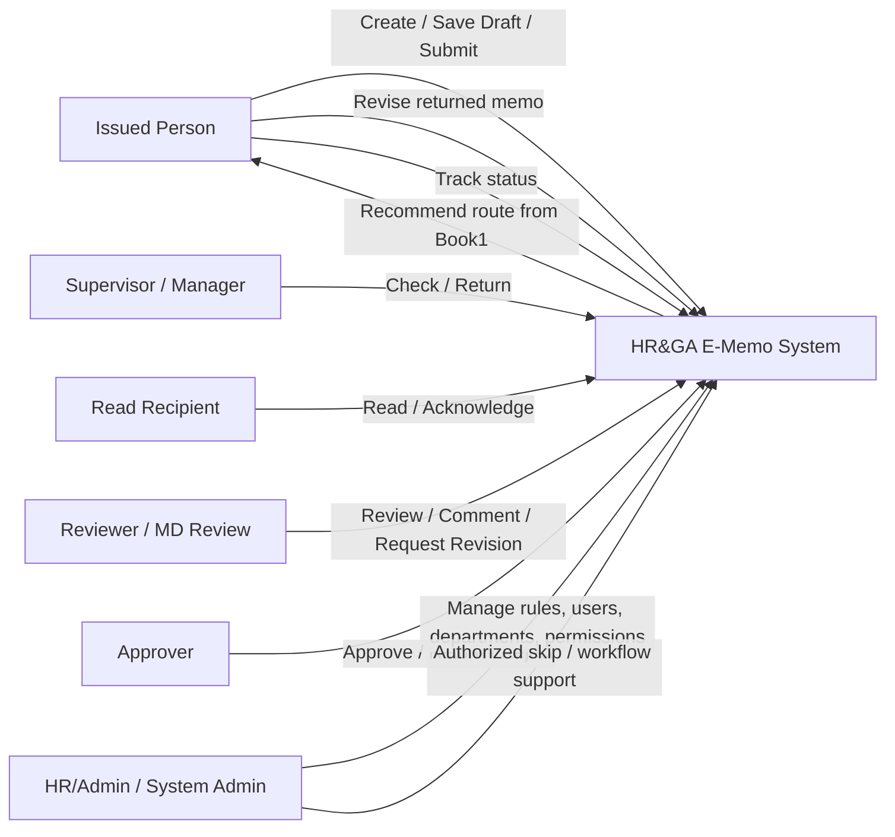
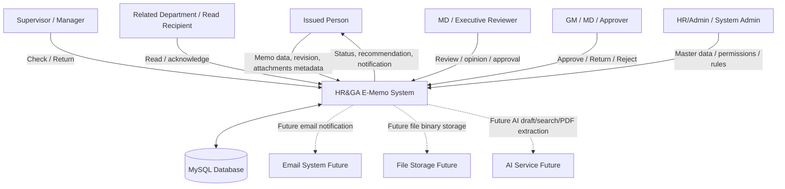
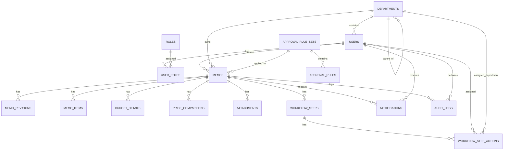

# HR&GA E-Memo System Analysis, DFD, and ERD Draft

Source context:
- Workbook: `D:\Hrproject\Book1.xlsx`
- Existing requirement extraction: `docs/requirements-from-excel.md`
- Prototype app: `sandbox/`
- Discussion date: 2026-05-27
- Target database direction: MySQL

This document is a working SA draft for implementing the HR&GA E-Memo system beyond the current prototype. It captures the flexible workflow decisions, DFD, ERD, MySQL-oriented table design, and open remarks needed for future implementation or for another AI agent/developer to continue safely.

## 1. Project Overview

The HR&GA E-Memo system is intended to replace paper/manual internal memo workflows with an online memo creation, routing, approval, and tracking system.

The system should support:
- Memo creation by all active users.
- Supervisor/Manager checking.
- Read/acknowledgement routing before approval.
- Approval recommendation based on `Book1.xlsx`.
- Flexible workflow adjustment for real-world coordination.
- Dashboard queues and in-app notifications for prototype validation.
- Search/history/audit tracking.
- Future MySQL persistence, authentication, email, and optional AI features.

Initial implementation should remain flexible. `Book1.xlsx` should guide recommendations, not become an overly rigid hardcoded chain that prevents real working patterns.

## 2. Business Context From Book1

Current pain points:
- Memo documents are created manually using document/Excel files.
- Paper printing and circulated signatures slow the approval process.
- Attachments are stored separately.
- Status tracking requires manual follow-up.
- Historical search is difficult because data is spread across paper, Excel, email, and file storage.

Expected solution:
- E-Memo Online.
- Workflow Approval Online.
- Dashboard for status tracking.
- Notification for pending actions.
- Search memo history by keyword or memo number.
- Optional AI draft, AI search, and PDF quote extraction in later phases.

Business targets:
- Reduce memo creation/approval time from 2-5 days to within 1 day or a few hours.
- Reduce manual errors.
- Improve productivity.
- Improve traceability and historical document retrieval.

## 3. Scope

### Initial System Scope

- Create memo.
- Save draft.
- Submit memo.
- Recommend approval route from approval rules.
- Allow flexible workflow customization with audit.
- Supervisor/Manager check.
- Read recipient acknowledgement.
- Authorized skip for Read steps with reason.
- MD Review/Opinion step for price adjustment cases.
- Approve, Return for Revision, Reject.
- Resubmit returned memo with same memo number and increased revision.
- Dashboard queues and in-app notification.
- History and audit timeline.
- MySQL-ready data model.

### Out Of Initial Scope

- Real email delivery.
- Full production authentication/SSO.
- ERP/accounting/procurement integration.
- Post-approval execution tracking such as payment, purchase order, asset disposal, or task completion.
- Production AI integration.
- Real file storage implementation.

REMARK: Approved memo handling ends in E-Memo for now. After approval, the system notifies the Issued Person to continue the next business process outside the E-Memo system, such as expense disbursement, purchasing, asset sale, or related operation. Future phases may add post-approval tracking.

REMARK: AI features are optional and non-core. The current prototype may keep AI-assisted features such as memo draft suggestion, AI search, and PDF quotation extraction for experimentation. However, the production E-Memo workflow must be able to create, route, check, read, review, approve, return, reject, search, and audit memos without AI. Future AI adoption may change depending on company policy, data privacy review, budget, provider availability, model quality, and user acceptance. Any AI calls must remain server-side, environment-gated, permission-aware, and auditable.

## 4. Core Design Principle

The system should use a **Flexible Workflow + Approval Recommendation** model.

Meaning:
- `Book1.xlsx` provides default approval recommendations.
- The system recommends a route, but the user may adjust it.
- The workflow must support real-world coordination with related departments.
- Lower-than-recommended or skipped approval route requires reason.
- Extra checks/read/review steps are allowed and should be audited.
- All workflow actions must be traceable.

## 5. Actors And Roles

### System Roles

`Issued Person`
: Base role for active users. Any active user can create a memo.

`Supervisor / Manager`
: Combined first checking role for the initial design. This follows the paper flow wording: `Checked = ผู้ที่ทำการตรวจสอบ Supervisor / Manager`.

`GM / SGM`
: Higher-level approver depending on approval matrix, department scope, or workflow assignment.

`MD`
: Executive approver or reviewer. MD may be final approver or may provide review/opinion for price adjustment cases.

`HR/Admin`
: Supports workflow, can manage process issues, can skip Read with reason where authorized, and may have broader visibility.

`System Admin`
: Manages users, roles, departments, approval rules, and system configuration.

### Workflow Roles

Workflow role is contextual per memo:
- Creator / Issued Person
- Checker
- Read Recipient
- Reviewer
- Approver
- Admin/Workflow Controller

REMARK: A user with an elevated role can still act as Issued Person when creating their own memo. Example: a Manager can create a memo and also approve other memos.

### 5.1 Department / Recipient Master Draft

Initial master draft should follow the paper form recipient checkbox list:

```text
MD
SGM
GM
FM
HR&GA
ACC/FIN
DC
IT
MK
QA/QC
R&D
PU
PC
LGT
EN
PE
MT
PD
MIX
CUT
FMG
FNG/NT
EXT
PLA
```

Use this list as the starting selectable master for departments/recipient units in routing, Read recipients, and visibility design.

REMARK: `MD`, `SGM`, `GM`, and `FM` may represent executive roles or recipient groups rather than normal departments. Because the paper form exposes them in the same recipient checkbox area, the system should initially support them as selectable routing/recipient units. During real master-data setup, confirm whether each item is a department, role, executive office, or recipient group.

REMARK: The current prototype department dropdown has only 6 options (`HR&GA`, `Production`, `IT`, `Engineering`, `GA`, `Maintenance`). Future implementation should replace this hardcoded dropdown with database-backed master data based on the confirmed department/recipient list.

## 6. Key Business Rules

### 6.1 First Check

Default first required step:

```text
Issued Person
→ Supervisor / Manager CHECK
```

Supervisor and Manager are treated as one combined step for the initial design.

REMARK: Supervisor and Manager may be separated into distinct workflow steps in the future if the company confirms both levels must independently review.

### 6.2 Read Recipient

Read Recipient means a person or role that must acknowledge the memo before approval.

Read Recipient may be:
- Head/representative of requester department.
- Head/representative of another related department.
- Custom user selected in workflow.

Read Recipient has no approve/reject authority unless also assigned as Approver.

REMARK: For memos created by a department itself, the initial design may suggest the requester department head or representative as Read Recipient. This rule is not final and may change based on company policy or department structure.

### 6.3 Read Step Blocking And Skip

Normal flow:

```text
Supervisor / Manager CHECK
→ Read Recipient READ
→ Approver APPROVE
```

Read is blocking by default. If the Read Recipient has not read, the memo should not proceed to approval.

Authorized skip is allowed with reason:
- Supervisor / Manager who checked the memo.
- HR/Admin.
- Future roles configured in permission matrix.

Requester should not skip Read in the initial design.

Every skip requires:
- Skip reason.
- Actor.
- Timestamp.
- Audit log.

### 6.4 Reader Is Also Approver

If the same user is assigned as both Read Recipient and Approver in the same memo route:
- Merge into one actionable workflow step.
- Display as `READ + APPROVE`.
- Approval action automatically satisfies Read acknowledgement.
- Audit must record that Read was completed by the approval action.

Do not merge merely because users are in the same department or have similar roles. Merge only when it is the same user.

### 6.5 MD Review For Price Adjustment

Book1 includes wording similar to `ยกเว้นปรับราคา ต้องเสนอ MD`.

System interpretation:
- This should be `MD Review / Opinion Required`.
- It is stronger than simple Read.
- It does not automatically mean MD must be final approver in every case.

MD Review is a blocking step. MD must respond before workflow continues.

Possible MD Review outcomes:
- `acknowledged_no_objection`: MD has no objection; workflow continues.
- `comment`: MD provides opinion/comment; workflow continues with comment.
- `request_revision`: MD requests correction/additional information; send back to Issued Person.
- `escalate_to_md_approval`: MD becomes final approver.

If the approval matrix already requires MD as final approver, merge `MD_REVIEW + APPROVE` into one MD action step.

### 6.6 Approved

Approved means the authorized approver has approved the memo.

Initial behavior:
- Notify Issued Person.
- Mark memo workflow as approved/completed in E-Memo.
- Issued Person continues any next business process outside E-Memo.

REMARK: Future phases may add post-approval tracking such as procurement, payment, asset disposal, or operational task follow-up.

### 6.7 Return For Revision

Return means the document or supporting information is incomplete/incorrect and needs correction before final approval decision.

Return behavior:
- Requires return reason/correction request.
- Sends memo back to Issued Person.
- Uses same memo number.
- Increments revision number.
- After Issued Person resubmits, the memo must go back to Supervisor / Manager CHECK again every time.

Reason: Even small edits may affect document readiness; the requester department should re-check before the memo proceeds.

### 6.8 Reject

Reject means an authorized approver does not approve the request.

When rejecting, the approver should choose a disposition:

`Reject & Close`
: Default. Memo is closed as rejected. If the business wants to request again, create a new memo or duplicate from the rejected one.

`Reject With Revision Allowed`
: Approver allows Issued Person to revise and resubmit using the same memo number and incremented revision. After revision:
- If changes are minor, return directly to the rejecting actor.
- If changes affect approval/risk-driving fields, return to Supervisor / Manager CHECK.

Approval/risk-driving fields include:
- Category.
- Amount.
- Budget status.
- Request items that change amount.
- Selected vendor.
- Vendor price comparison.
- Approval route/final approver.
- Price adjustment flag.
- Over/no-budget flag.
- Department monthly over-budget total.

### 6.9 Price / Vendor Comparison

Book1 includes a note that purchase/sale cases should compare at least 3 vendors or provide discount/other reason.

Initial interpretation:
- Price comparison is optional supporting information.
- Do not hard-block submit if fewer than 3 vendors are provided.
- Let users enter it when available.
- Let Supervisor/Manager or Approver evaluate it during review.

REMARK: This requirement appears in Book1 but not as a confirmed standard flow rule. Keep it optional until policy is confirmed.

### 6.10 Approval Rules

Admin should be able to manage approval rules in the future.

Approval rules should have:
- Effective date.
- Active/inactive status.
- Versioning.
- Change reason.
- Audit log.

Memo should keep the rule version used at submission time so old memos do not change unexpectedly when rules are updated.

## 7. Recommended Workflow State Model

High-level states:

```text
draft
submitted
pending_check
pending_read
pending_review
pending_approval
returned_for_revision
issuer_revising
rejected_closed
rejected_revision_allowed
approved
cancelled
```

Workflow actions:

```text
submit
check
read
skip_read
review
approve
return_for_revision
reject_close
reject_allow_revision
revise
resubmit
cancel
```

## 8. Use Case Diagram



## 9. Main Use Cases

| ID | Use Case | Primary Actor | Summary |
| --- | --- | --- | --- |
| UC-01 | Create Memo | Issued Person | Create a new memo with subject, category, amount, description, budget, and optional supporting data. |
| UC-02 | Save Draft | Issued Person | Save incomplete memo before submission. |
| UC-03 | Submit Memo | Issued Person | Submit memo into workflow. |
| UC-04 | Recommend Approval Route | System | Use approval rules to recommend final approver and default route. |
| UC-05 | Customize Workflow | Issued Person | Add Read/Review/Check/Approver steps where needed. |
| UC-06 | Supervisor/Manager Check | Supervisor / Manager | First required check step. |
| UC-07 | Read Acknowledgement | Read Recipient | Required acknowledgement before approval unless skipped by authorized user. |
| UC-08 | Skip Read | Supervisor/Manager, HR/Admin | Skip Read step with required reason. |
| UC-09 | MD Review / Opinion | MD | Review price adjustment cases and provide response. |
| UC-10 | Approve Memo | Approver | Approve memo and notify Issued Person. |
| UC-11 | Return For Revision | Checker/Reviewer/Approver | Return memo for correction; resubmission goes to Supervisor/Manager check. |
| UC-12 | Reject Memo | Approver | Reject and close by default, or allow revision if selected. |
| UC-13 | Revise Memo | Issued Person | Edit memo after Return or allowed rejection using same memo number and revision. |
| UC-14 | View Dashboard Queue | User | View pending actions and submitted memo status. |
| UC-15 | Search / History | Authorized User | Search visible memos by keyword, memo number, status, or category. |
| UC-16 | Manage Master Data | Admin | Manage users, departments, roles, permissions, and approval rules. |
| UC-17 | View Audit Trail | Authorized User | Review workflow actions and changes. |

## 10. Use Case Details

### UC-03 Submit Memo

Preconditions:
- Memo has required fields.
- Issued Person is active.

Main flow:
1. Issued Person submits memo.
2. System validates required fields.
3. System calculates approval recommendation.
4. System builds workflow steps.
5. System stores submission snapshot and rule version.
6. System sends in-app notification to first actionable user.

Exceptions:
- If route is below recommendation or skips required recommendation steps, route override reason is required.
- If Read Recipient and Approver are same user, system merges actions.

### UC-06 Supervisor/Manager Check

Preconditions:
- Memo has been submitted.
- Supervisor/Manager step is pending.

Main flow:
1. Supervisor/Manager opens pending check queue.
2. Reviews memo details and attachments.
3. Chooses Check/Return.
4. If checked, memo proceeds to Read or next step.
5. If returned, memo goes to Issued Person for revision.

### UC-07 Read Acknowledgement

Preconditions:
- Supervisor/Manager check is complete.
- Read step exists and is pending.

Main flow:
1. Read Recipient opens pending read queue.
2. Reads memo.
3. Clicks acknowledge/read.
4. Memo proceeds to next workflow step.

Alternative:
- Authorized user skips Read with reason.

### UC-09 MD Review / Opinion

Preconditions:
- Memo requires MD Review due to price adjustment or related rule.

Main flow:
1. MD receives pending review.
2. MD reviews memo and provides response.
3. System stores response and audit log.
4. Workflow continues, returns, or escalates based on MD response.

### UC-12 Reject Memo

Preconditions:
- User is authorized approver for current step.

Main flow:
1. Approver chooses Reject.
2. System opens Reject modal.
3. Default option is Reject & Close.
4. Approver enters required reason.
5. Memo becomes `rejected_closed`.

Alternative:
- Approver chooses Reject With Revision Allowed.
- Memo becomes `rejected_revision_allowed` and returns to Issued Person for revision.

## 11. DFD Context Diagram



## 12. DFD Level 1

```mermaid
flowchart TD
  P1["1. Create / Edit Memo"]
  P2["2. Approval Recommendation"]
  P3["3. Build Flexible Workflow"]
  P4["4. Process Workflow Action"]
  P5["5. Notify / Queue"]
  P6["6. Search / Dashboard / History"]
  P7["7. Admin Configuration"]
  P8["8. Audit / Revision Control"]

  D1[("Memos")]
  D2[("Memo Revisions")]
  D3[("Memo Items")]
  D4[("Budget Details")]
  D5[("Price Comparisons")]
  D6[("Workflow Steps")]
  D7[("Workflow Step Actions")]
  D8[("Approval Rules")]
  D9[("Users / Roles / Departments")]
  D10[("Notifications")]
  D11[("Attachments")]
  D12[("Audit Logs")]

  P1 --> D1
  P1 --> D2
  P1 --> D3
  P1 --> D4
  P1 --> D5
  P1 --> D11

  P2 --> D8
  P2 --> D1

  P3 --> D6
  P3 --> D7
  P3 --> D12

  P4 --> D1
  P4 --> D6
  P4 --> D7
  P4 --> D12
  P4 --> D2

  P5 --> D10
  P5 --> D6

  P6 --> D1
  P6 --> D6
  P6 --> D10
  P6 --> D12

  P7 --> D8
  P7 --> D9
  P7 --> D12

  P8 --> D2
  P8 --> D12
```



## 13. ERD Concept



## 14. MySQL Table Design Draft

This is a logical design. Final DDL should be produced only after implementation approval.

### 14.1 users

Stores active users who can access the system. Every active user can act as Issued Person.

| Column | Type | Notes |
| --- | --- | --- |
| id | BIGINT PK | Auto increment |
| employee_code | VARCHAR(50) UNIQUE | Employee code if available |
| full_name | VARCHAR(255) | Display name |
| email | VARCHAR(255) UNIQUE NULL | For future email notification/login |
| department_id | BIGINT FK | Current department |
| position_title | VARCHAR(255) NULL | Job title |
| is_active | BOOLEAN | Active user can create memo |
| created_at | DATETIME |  |
| updated_at | DATETIME |  |

### 14.2 departments

| Column | Type | Notes |
| --- | --- | --- |
| id | BIGINT PK |  |
| code | VARCHAR(50) UNIQUE | HRGA, IT, ACCFIN, etc. |
| name_th | VARCHAR(255) | Thai name |
| name_en | VARCHAR(255) NULL | English name |
| parent_department_id | BIGINT FK NULL | For hierarchy |
| head_user_id | BIGINT FK NULL | Suggested department head |
| default_read_recipient_user_id | BIGINT FK NULL | Optional default reader |
| is_active | BOOLEAN |  |

### 14.3 roles

| Column | Type | Notes |
| --- | --- | --- |
| id | BIGINT PK |  |
| code | VARCHAR(80) UNIQUE | supervisor_manager, gm, md, hr_admin, system_admin |
| name | VARCHAR(255) | Display name |
| description | TEXT NULL |  |

REMARK: `issued_person` may be implicit for every active user. `roles` should mainly store elevated permissions.

### 14.4 user_roles

| Column | Type | Notes |
| --- | --- | --- |
| id | BIGINT PK |  |
| user_id | BIGINT FK |  |
| role_id | BIGINT FK |  |
| scope_department_id | BIGINT FK NULL | Optional department scope |
| created_at | DATETIME |  |

### 14.5 permissions

| Column | Type | Notes |
| --- | --- | --- |
| id | BIGINT PK |  |
| code | VARCHAR(100) UNIQUE | skip_read_step, manage_rules, view_all_memos |
| description | TEXT |  |

### 14.6 role_permissions

| Column | Type | Notes |
| --- | --- | --- |
| id | BIGINT PK |  |
| role_id | BIGINT FK |  |
| permission_id | BIGINT FK |  |
| scope | VARCHAR(80) | own_department, assigned_workflow, all |

### 14.7 approval_rule_sets

Used to version approval rules.

| Column | Type | Notes |
| --- | --- | --- |
| id | BIGINT PK |  |
| name | VARCHAR(255) | Example: Book1 Effective 2025-06-01 |
| source_reference | VARCHAR(255) | Example: Book1.xlsx Table 2 |
| effective_date | DATE |  |
| is_active | BOOLEAN |  |
| created_by | BIGINT FK | Admin |
| created_at | DATETIME |  |
| change_reason | TEXT NULL |  |

### 14.8 approval_rules

| Column | Type | Notes |
| --- | --- | --- |
| id | BIGINT PK |  |
| rule_set_id | BIGINT FK |  |
| category | VARCHAR(80) | raw_material, fixed_asset, service_contract, general_purchase, mold |
| budget_status | VARCHAR(50) | in_budget, over_budget, no_budget, any |
| min_amount | DECIMAL(15,2) NULL | Inclusive |
| max_amount | DECIMAL(15,2) NULL | Inclusive; null means no upper bound |
| condition_key | VARCHAR(100) NULL | follows_production_plan, price_adjustment, monthly_over_budget |
| recommended_final_role | VARCHAR(80) | supervisor_manager, gm, md |
| requires_md_review | BOOLEAN | Price adjustment review |
| description | TEXT | Human explanation |
| priority | INT | Rule matching order |
| is_active | BOOLEAN |  |

### 14.9 memos

| Column | Type | Notes |
| --- | --- | --- |
| id | BIGINT PK |  |
| memo_no | VARCHAR(50) UNIQUE | Stable memo number |
| current_revision_no | INT | Starts at 0 |
| requester_id | BIGINT FK | Issued Person |
| department_id | BIGINT FK | Requester department |
| subject | VARCHAR(500) |  |
| description | TEXT | Why/necessity/details |
| category | VARCHAR(80) |  |
| amount | DECIMAL(15,2) |  |
| budget_status | VARCHAR(50) |  |
| status | VARCHAR(80) | draft, pending_check, approved, etc. |
| current_step_id | BIGINT FK NULL | Current workflow step |
| applied_rule_set_id | BIGINT FK NULL | Rule version used |
| recommended_final_role | VARCHAR(80) NULL | From rule engine |
| selected_final_role | VARCHAR(80) NULL | User/workflow selected |
| route_mode | VARCHAR(80) NULL | recommended, custom_added, escalated, exception |
| route_override_reason | TEXT NULL | Required for exceptions |
| requires_md_review | BOOLEAN | Derived from rule/input |
| md_review_status | VARCHAR(80) NULL | pending, completed, escalated |
| reject_disposition | VARCHAR(80) NULL | close, allow_revision |
| created_at | DATETIME |  |
| submitted_at | DATETIME NULL |  |
| approved_at | DATETIME NULL |  |
| closed_at | DATETIME NULL |  |
| updated_at | DATETIME |  |

### 14.10 memo_revisions

| Column | Type | Notes |
| --- | --- | --- |
| id | BIGINT PK |  |
| memo_id | BIGINT FK |  |
| revision_no | INT | 0, 1, 2... |
| revision_source | VARCHAR(80) | initial, return, rejection_allowed |
| revision_impact | VARCHAR(80) | minor, approval_affecting |
| requested_by | BIGINT FK NULL | User who returned/rejected |
| requested_reason | TEXT NULL | Reason from return/reject |
| change_summary | TEXT NULL | Issued Person summary |
| snapshot_json | JSON | Memo snapshot at this revision |
| created_by | BIGINT FK | User who created revision |
| created_at | DATETIME |  |

### 14.11 memo_items

| Column | Type | Notes |
| --- | --- | --- |
| id | BIGINT PK |  |
| memo_id | BIGINT FK |  |
| revision_no | INT | Optional revision association |
| item_name | VARCHAR(500) |  |
| unit | VARCHAR(80) |  |
| quantity | DECIMAL(12,2) |  |
| unit_price | DECIMAL(15,2) |  |
| line_total | DECIMAL(15,2) | Can be computed by app/db |

### 14.12 budget_details

| Column | Type | Notes |
| --- | --- | --- |
| id | BIGINT PK |  |
| memo_id | BIGINT FK |  |
| account_code | VARCHAR(100) NULL |  |
| account_description | VARCHAR(500) NULL |  |
| budget_plan | DECIMAL(15,2) NULL |  |
| budget_used | DECIMAL(15,2) NULL |  |
| request_amount | DECIMAL(15,2) |  |
| remaining_amount | DECIMAL(15,2) NULL |  |
| department_monthly_over_budget_total | DECIMAL(15,2) NULL | Rule-related value |

### 14.13 price_comparisons

Optional supporting information.

| Column | Type | Notes |
| --- | --- | --- |
| id | BIGINT PK |  |
| memo_id | BIGINT FK |  |
| vendor_name | VARCHAR(255) |  |
| offered_price | DECIMAL(15,2) |  |
| discount | DECIMAL(15,2) DEFAULT 0 |  |
| vat_enabled | BOOLEAN DEFAULT FALSE | User-controlled |
| vat_rate | DECIMAL(5,4) DEFAULT 0.0700 | 7% current default |
| vat_amount | DECIMAL(15,2) |  |
| net_total | DECIMAL(15,2) |  |
| is_selected | BOOLEAN |  |
| reason_if_not_lowest | TEXT NULL | Optional/soft validation |
| remark | TEXT NULL |  |

### 14.14 attachments

Stores metadata. File binary storage can be local/network/object storage in future.

| Column | Type | Notes |
| --- | --- | --- |
| id | BIGINT PK |  |
| memo_id | BIGINT FK |  |
| revision_no | INT NULL | Attachment revision |
| file_name | VARCHAR(500) |  |
| file_path | VARCHAR(1000) | Future storage path |
| mime_type | VARCHAR(255) NULL |  |
| file_size_bytes | BIGINT NULL |  |
| uploaded_by | BIGINT FK |  |
| uploaded_at | DATETIME |  |
| is_deleted | BOOLEAN | Soft delete |

### 14.15 workflow_steps

Represents ordered workflow steps.

| Column | Type | Notes |
| --- | --- | --- |
| id | BIGINT PK |  |
| memo_id | BIGINT FK |  |
| step_order | INT |  |
| step_group | VARCHAR(80) | check, read, review, approval |
| role_label | VARCHAR(255) | Supervisor / Manager, MD Review, GM |
| is_required | BOOLEAN |  |
| is_blocking | BOOLEAN | Read should be blocking by default |
| can_skip | BOOLEAN | True for authorized skip steps |
| is_from_recommendation | BOOLEAN | From Book1 route |
| status | VARCHAR(80) | pending, active, completed, skipped, returned, rejected |
| activated_at | DATETIME NULL |  |
| completed_at | DATETIME NULL |  |

### 14.16 workflow_step_actions

Allows one step to require multiple actions, such as `READ + APPROVE` or `MD_REVIEW + APPROVE`.

| Column | Type | Notes |
| --- | --- | --- |
| id | BIGINT PK |  |
| workflow_step_id | BIGINT FK |  |
| action_type | VARCHAR(80) | check, read, review, approve |
| assigned_user_id | BIGINT FK NULL | Specific user |
| assigned_department_id | BIGINT FK NULL | Department recipient |
| assigned_role_id | BIGINT FK NULL | Role-based assignment |
| status | VARCHAR(80) | pending, completed, skipped |
| action_result | VARCHAR(100) NULL | approved, returned, no_objection, escalate_to_md_approval |
| comment | TEXT NULL |  |
| acted_by | BIGINT FK NULL | Actual actor |
| acted_at | DATETIME NULL |  |
| skipped_by | BIGINT FK NULL |  |
| skipped_at | DATETIME NULL |  |
| skip_reason | TEXT NULL | Required when skipped |

### 14.17 notifications

Prototype should use in-app notifications/dashboard queue first.

| Column | Type | Notes |
| --- | --- | --- |
| id | BIGINT PK |  |
| memo_id | BIGINT FK |  |
| recipient_user_id | BIGINT FK |  |
| notification_type | VARCHAR(100) | pending_check, pending_read, approved, returned |
| title | VARCHAR(500) |  |
| message | TEXT |  |
| is_read | BOOLEAN | Notification read state |
| requires_action | BOOLEAN | Queue item or info only |
| created_at | DATETIME |  |
| read_at | DATETIME NULL |  |

### 14.18 audit_logs

| Column | Type | Notes |
| --- | --- | --- |
| id | BIGINT PK |  |
| memo_id | BIGINT FK NULL |  |
| actor_id | BIGINT FK NULL | System actions may be null |
| action | VARCHAR(120) | submit, check, skip_read, approve, update_rule |
| target_type | VARCHAR(120) | memo, workflow_step, rule |
| target_id | BIGINT NULL |  |
| reason | TEXT NULL | Required for skips/returns/rejections |
| before_json | JSON NULL |  |
| after_json | JSON NULL |  |
| created_at | DATETIME |  |

### 14.19 memo_access

Optional materialized access table/view for performance and clarity.

| Column | Type | Notes |
| --- | --- | --- |
| id | BIGINT PK |  |
| memo_id | BIGINT FK |  |
| user_id | BIGINT FK |  |
| access_reason | VARCHAR(100) | creator, checker, reader, reviewer, approver, department_manager, admin |
| can_view | BOOLEAN |  |
| can_action | BOOLEAN |  |
| created_at | DATETIME |  |

## 15. Visibility Matrix

| User Type | Can View | Can Act |
| --- | --- | --- |
| Issued Person | Own memos and memos where assigned in workflow | Create, revise own returned/allowed memo |
| Read Recipient | Memos assigned for read | Read/acknowledge |
| Supervisor / Manager | Memos assigned to them and memos in responsible department/team | Check, Return, authorized Skip Read |
| GM / SGM | Memos assigned to their approval/review scope | Approve, Return, Reject |
| MD | Executive review/approval queue and executive overview | Review, Approve, Return, Reject, escalate |
| HR/Admin | All or broad support scope | Workflow support, authorized Skip Read, audit support |
| System Admin | System configuration scope | Manage users, roles, permissions, approval rules |

## 16. Notification Strategy

Initial prototype:
- In-app notifications.
- Dashboard queue.
- Sidebar/action badges.
- Memo timeline.

Do not implement real email in the initial system.

Future phase:
- Email notification.
- Reminder/escalation email.
- Daily/weekly digest.
- Email links back to memo detail.
- Optional AI-assisted search summaries or ranking, only after permissions and audit are stable.

Notification events:
- Memo submitted to Supervisor/Manager.
- Memo waiting for Read Recipient.
- Read skipped.
- Memo waiting for MD Review.
- Memo waiting for Approver.
- Memo approved.
- Memo returned for revision.
- Memo rejected and closed.
- Memo rejected with revision allowed.
- Revision resubmitted.

REMARK: Book1/project requirement mentions email notification, but prototype should validate workflow with in-app notification first.

REMARK: AI Search should be treated as an assistive layer, not the authoritative search engine. Basic search and permission-filtered database queries must remain the source of truth. If AI Search is kept or expanded, the system must filter visible memos by user permission before sending candidates to any AI provider.

## 17. Create Memo UX Direction

Use a **Guided Single-page Form**, not a full multi-page wizard, for the initial design.

Reason:
- Current prototype already uses a single-page form.
- Category, amount, budget status, approval route, MD review, and workflow suggestions affect each other immediately.
- A wizard may cause unnecessary back-and-forth.

Recommended layout:

Required / always visible:
- Subject.
- Issued Person.
- Department.
- Category.
- Amount.
- Budget status.
- Description.
- Supervisor / Manager CHECK.

Recommended / system assisted:
- Approval recommendation.
- Final approver route.
- Read recipient suggestion.
- MD Review if price adjustment.

Optional / collapsible:
- Request items.
- Budget detail.
- Attachments.
- Price comparison.
- AI draft.
- PDF quote extraction.
- Advanced route override.

REMARK: As of prototype Stage 5B, `readActions` blocks Approve for memos created with read recipients — Approve is disabled until all entries are `"read"` or `"skipped"`. A Skip All Reads mode with required reason is implemented. However, this enforcement is prototype-grade only: there are no identity checks (any drawer viewer can acknowledge or skip for any recipient). For the real system, Read Recipient enforcement must be backed by authentication and the `workflow_step_actions` permission model in §14.16. The second prototype gap — Read Recipient placement in the create form — remains open: it is still inside the budget card rather than in a dedicated Workflow/Routing section.

## 18. Approval Matrix Summary From Book1

Use Book1 as default recommendation source.

REMARK: In `Book1.xlsx` Table 2, the indented dash (`- ...`) entries under each numbered `รายการ` category are item subcategories. Examples include raw material subitems (`วัตถุดิบ และ ชิ้นงาน`, `วัสดุประกอบ`, `วัสดุสิ้นเปลือง`, `วัสดุโรงงาน`, `ซื้อเพื่อทดลอง หรือ งานตัวอย่าง`), fixed asset subitems (`เครื่องจักร และ อุปกรณ์การผลิต`, `เครื่องมือเครื่องใช้โรงงาน`, `เครื่องมือเครื่องใช้สำนักงาน`, `รถยนต์`, `สินทรัพย์อื่น ๆ`), service/job subitems (`ระบบสาธารณูปโภค`, `การซ่อมแซมบำรุงรักษาโรงงาน`, `สำนักงาน และ โรงงาน`, `อื่น ๆ`), and general purchase subitems (`สวัสดิการพนักงาน`, `ซื้ออุปกรณ์เครื่องมือเครื่องใช้ / ซ่อมบำรุง`, `ซื้อของทั่วไปสำนักงาน - โรงงาน`, `อื่น ๆ`). Treat these as selectable/detail master data under the parent category for UI, reporting, and search. In the UI, use them only after the user has selected the main category, as a secondary refinement choice that supports description, reporting, and search. They should not become separate approval-rule categories unless confirmed by the business.

High-level rules:
- Mold: MD every time.
- Raw material / production material:
  - Production plan cases recommend GM.
  - In-budget ranges escalate by amount.
  - Over/no-budget uses department monthly quota logic.
  - Price adjustment requires MD Review/Opinion.
- Fixed assets:
  - In-budget up to threshold recommends GM.
  - Higher or out-of-budget cases recommend MD.
  - Price adjustment requires MD Review/Opinion.
- Service contract / general purchase:
  - Lower amount can be Manager/Top Section.
  - Mid amount recommends GM.
  - High amount recommends MD.
  - Over/no-budget cases escalate based on amount/quota.

Implementation note:
- Store exact rules in `approval_rule_sets` and `approval_rules`.
- Memo should record the rule set used.
- Admin edits should create new rule versions instead of overwriting old behavior silently.

## 19. Prototype-To-Implementation Roadmap

### Phase 1: SA And Data Design

- Finalize this SA.
- Confirm department list.
- Confirm user/role hierarchy.
- Confirm approval rule interpretation.
- Confirm workflow status names.

### Phase 2: MySQL Persistence Foundation

- Create MySQL schema.
- Add data access layer/server-side APIs.
- Persist memos, revisions, workflow steps, notifications, audit logs.
- Keep provider/API keys server-side.

### Phase 3: Workflow Engine

- Implement dynamic workflow steps.
- Implement CHECK, READ, REVIEW, APPROVE actions.
- Implement Return and Reject dispositions.
- Implement revision/resubmission rules.
- Implement rule versioning.

### Phase 4: UI Integration

- Refactor create flow into focused components/hook before adding more behavior.
- Move Read Recipient into workflow section.
- Add queue filters by action type.
- Add notification center/dashboard cards.
- Add timeline/audit display.

### Phase 5: Authentication And Permissions

- Add real login/SSO or chosen authentication.
- Implement role/permission matrix.
- Implement memo visibility rules.

### Phase 6: Future Enhancements

- Email notification.
- Real file storage.
- Optional AI draft/search/PDF extraction production hardening, if the company decides to keep AI features.
- Post-approval process tracking.
- Admin rule editor.

## 20. Open Questions And REMARK List

Confirmed:
- Every active user can create memo as Issued Person.
- Supervisor/Manager is one combined first CHECK step for now.
- Read occurs before approval.
- Read is blocking but can be skipped by authorized roles with reason.
- Same user assigned READ + APPROVE should be merged.
- Price adjustment requires MD Review/Opinion, not merely Read and not always MD final approval.
- Return always goes back to Supervisor/Manager CHECK after Issued Person revision.
- Reject defaults to close, but approver can allow revision.
- Approved ends E-Memo workflow for now and notifies Issued Person.
- Price comparison is optional supporting information.
- Prototype notification should be in-app/dashboard queue first.
- Target database is MySQL.
- AI features currently present in the prototype should remain optional/non-core; future production may include or exclude them.
- Initial department/recipient master draft follows the paper form list: MD, SGM, GM, FM, HR&GA, ACC/FIN, DC, IT, MK, QA/QC, R&D, PU, PC, LGT, EN, PE, MT, PD, MIX, CUT, FMG, FNG/NT, EXT, PLA.

Still may change:
- Exact department list and department head/default reader mapping.
- Classification of MD/SGM/GM/FM as department, executive role, executive office, or recipient group.
- Whether Supervisor and Manager must be separated later.
- Exact MD Review outcomes allowed in production.
- Whether rejected-allowed revision should ever require a fully new memo number.
- Whether post-approval process should be tracked in a later module.
- Whether price comparison becomes mandatory for specific request types in company policy.
- Final authentication provider and permission implementation.
- Future AI scope, provider, budget, data privacy approval, and whether AI remains in production.

## 21. Suggested Next Deliverables

Before implementation:
1. Review this SA with HR&GA / IT / representative users.
2. Confirm department master list.
3. Confirm role names and approval hierarchy.
4. Convert ERD draft into MySQL DDL.
5. Create implementation plan for database + workflow engine.
6. Refactor `sandbox/src/app/create/page.tsx` before adding more workflow behavior.

## 22. Prototype Implementation Status (as of Stage 5B, 2026-05-28)

This section records which workflow behaviors from the real-system design above are now prototype-implemented in `sandbox/`. All implementations are frontend-only, in-memory, without database persistence, and without identity or permission checks. This section is informational — it does not change any design decisions above.

| Feature | Design Reference | Prototype Status |
| --- | --- | --- |
| Return For Revision with required reason | §6.7, UC-11 | **Live (Stage 4A).** `RETURN_MEMO` action. Requires non-empty return reason. Memo moves to `returned` status. Returned tab visible in queue. `returnReason` displayed in drawer. |
| Resubmit after Return with optional correction note | §6.7 | **Live (Stage 4B).** `RESUBMIT_MEMO` action. Resets step to `selectedRoute[0]`. Preserves `returnReason` for audit trail. Optional `revisionNote` shown as green banner. `readActions` reset to pending. |
| Step-by-step approval advancement | §6.1, §7, UC-10 | **Live (Stage 4C).** `ADVANCE_STEP` walks `currentStep` through `selectedRoute`; approves terminally at last step. `workflowState` → `"Checked"` on intermediate steps, `"Approved"` on final. Non-pending memos are never touched. |
| Read recipient acknowledgement tracking | §6.2, §6.3, UC-07 | **Live (Stage 5A/5B).** `readActions` populated on pending submit. `MARK_READ` per recipient. Timeline entries in drawer with `รับทราบ (Prototype)` button. Approve disabled while any entry is `"pending"`. |
| Authorized Skip Read with required reason | §6.3, UC-08 | **Live (Stage 5B).** `SKIP_ALL_READS` with required skip reason. Does not overwrite already-`"read"` entries. Displayed in timeline as "ข้าม · {reason}". |

Not yet implemented in prototype (for reference):

- Revision number increment on resubmit (§6.7, §14.10 `memo_revisions`)
- Reject With Revision Allowed vs. Reject & Close distinction (§6.8, UC-12)
- MD Review / Opinion step (§6.5, UC-09)
- Merged READ + APPROVE action for same-user scenario (§6.4)
- Permission/identity checks on any workflow action (§5, §14.5–§14.6)
- Read Recipient section moved to Workflow/Routing in create form (§17)
- Supervisor/Manager Check as a distinct logged action (§6.1, UC-06)
- Reject disposition: currently `UPDATE_STATUS → rejected` with no Reject & Close / Revision Allowed choice
